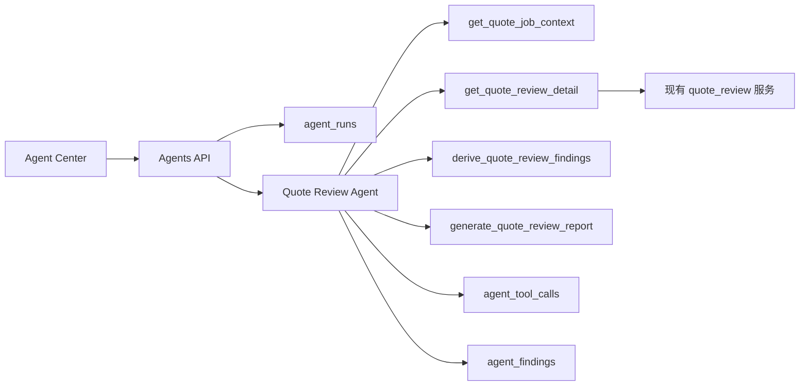

# Agentic Middle Office Phase 1：报价复核小助手

## 当前边界更新（2026-06-09）

报价审核 Agent 当前已调整为“报价后审计 Agent”：只做每日定时扫描当日已确认下发报价的后审计留痕，不再生成每日待办，不再进入建议采纳、草案执行或二次人工确认闭环。

当前审计重点是记录原预审风险、人工确认下发后的实际报价状态，以及修改前后的解释。预审风险已拆分为工程量改动和单价改动，两类阈值均沿用 25%。本 Agent 暂不使用企业内部 RAG 和 Memory；新增 `market_price_web_search_v1` 通过 Bing Web Search 查询东莞、深圳公开网页结果，再由 DeepSeek 归纳结构化解释，仅作为当次审计快照，不写入成本库。

## 定位

第一阶段不把现有报价系统改造成完整 multi-agent 架构，而是在现有中台旁边增加一个只读 Agent 层。它先服务一个确定、重复、低破坏面的场景：报价任务完成后，自动复核确认清单、AI 预审行、成本库证据和人工确认风险。

这个阶段的目标是让系统开始具备 Agent 工程能力，同时不影响现有报价、成本库、RAG、N8N、Dify、推送和审计规则。

## 为什么先做报价复核

- 任务真实存在：报价运营已经有逐行对账、占位行、无底价、成本库兜底、AI 改写风险等复核工作。
- 数据已经具备：`quote_jobs`、`quote_job_requirement_rows`、预审结果、成本证据链都已落库或可查询。
- 风险可控：Agent 只读分析和生成建议，不自动改价、不自动下发、不自动启用成本库。
- 技术可展示：具备 Agent Run、Tool Call、Finding、Recommendation、Trace 的基本结构，后续可以替换为 LangGraph / LLM / Memory / MCP。

## 当前能力边界

### 已实现

- 功能开关：`FEATURE_AGENT_ASSISTANTS=false` 默认关闭。
- 数据表：
  - `agent_runs`：一次 Agent 运行记录。
  - `agent_tool_calls`：Agent 内部工具调用轨迹。
  - `agent_findings`：Agent 输出的风险发现。
- API：
  - `POST /api/v1/admin/agents/quote-review/runs`
  - `GET /api/v1/admin/agents/runs`
  - `GET /api/v1/admin/agents/runs/{run_id}`
  - `GET /api/v1/admin/agents/runs/{run_id}/tool-calls`
  - `GET /api/v1/admin/agents/runs/{run_id}/findings`
  - `GET /api/v1/admin/agents/catalog`
- Agent 引擎：`rule_graph_v1`，默认不调用 LLM。
- 输入：报价任务 `quote_job_id`。
- 输出：风险等级、建议动作、风险发现、下一步处理建议、Markdown 摘要、工具轨迹。

### 明确不做

- 不自动修改报价结果。
- 不自动确认推送。
- 不自动新增或启用成本库 active。
- 不改 N8N、Dify、RAG、Milvus 链路。
- 不引入外部大模型依赖作为首版硬要求。

## 技术结构

## 后续演进

### Phase 1.1：内网试运行

- 只开放给管理员、报价运营、报价用户。
- 每个完成的报价任务手动点击运行。
- 观察 Agent 输出是否能减少人工复核遗漏。
- 不做自动触发。

### Phase 1.2：轻量自动触发

- 报价任务完成后自动生成一条只读 Agent 复核记录。
- 仍然只提示，不阻断现有流程。
- 若高风险，可在前端强调“建议先复核”。

### Phase 2：LLM 推理层

- 在 `rule_graph_v1` 后增加可选 LLM 总结节点。
- LLM 只做解释、归纳和建议，不直接写业务表。
- 可接入 Memory 保存常见复核偏好，例如管理员常忽略的风险类型。

### Phase 3：LangGraph / MCP 化

- 将当前工具链拆成标准节点：
  - 查询报价任务
  - 查询复核详情
  - 查询成本证据
  - 生成风险发现
  - 生成人工处理建议
- 用 LangGraph 编排状态机。
- 用 MCP 暴露内部系统工具，便于多个 Agent 共享。

### Phase 4：多部门 Agent

在报价复核稳定后，再扩展到：

- 成本库治理 Agent：发现重复、异常单位、价格异常、待启用 draft。
- 项目进度 Agent：提醒缺证据、延期节点、硬门禁放行后未补证据。
- 商务台账 Agent：提醒跟进超期、阶段异常、客户信息缺失。
- 管理员 Agent：汇总各部门 Agent 输出，形成经营待办。

## 验收标准

- 开关关闭时，所有 Agent API 返回 `FEATURE_DISABLED`。
- 开关打开后，用户只能复核自己可访问的报价任务；报价运营和管理员可查看全部。
- 运行 Agent 后必须产生：
  - 1 条 `agent_runs`
  - 多条 `agent_tool_calls`
  - 0 条或多条 `agent_findings`
- Agent 输出必须能识别：
  - 确认清单缺失报价行
  - AI 未返回占位行
  - 无成本库参考价
  - 成本库兜底
  - AI 改写或备注冲突风险
- Agent 不改变任何报价业务结果。
