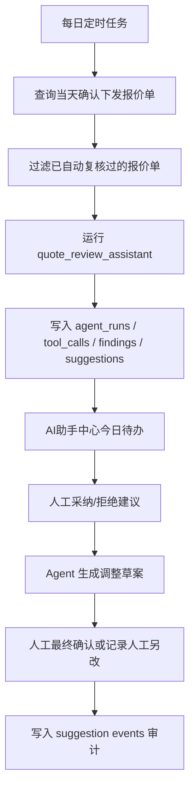

# Agentic Middle Office Phase 2：每日自动报价复核规划

## 当前边界更新（2026-06-09）

本文件下方保留 Phase 2 原始规划脉络。当前实现口径已经收敛为“每日自动报价后审计”：只扫描当日已确认下发的报价历史并创建审计记录，不再生成每日待办，不再生成可采纳建议，不再做草案执行或二次人工确认。

后审计记录重点包括原预审风险、最终确认下发状态、修改前后解释。预审风险拆分为工程量改动和单价改动，两类阈值均为 25%。本 Agent 暂不使用企业内部 RAG 和 Memory；`market_price_web_search_v1` 只在审计时通过 Bing Web Search 查询东莞、深圳公开网页结果，并由 DeepSeek 归纳解释，不沉淀为成本库市场价表。

## 背景

Phase 1 已跑通“人工主动复核闭环”：

- 人工输入报价任务号主动运行报价复核 Agent。
- Agent 输出风险发现、优化建议、预计节省金额和下一步处理建议。
- 人工可采纳或拒绝建议。
- Agent 在人工采纳后只生成调整草案，不直接修改报价单。
- 人工最终确认 Agent 草案，或记录未执行 Agent 建议但人工另行修改的结果。
- `agent_runs`、`agent_tool_calls`、`agent_findings`、`agent_suggestions`、`agent_suggestion_events` 已形成基础审计链。

Phase 2 不改变 Phase 1 的人工确认边界，目标是把同一套 Agent 能力扩展为每日定时自动复核，并在 AI 助手中心形成“今日待处理”运营入口。

## 目标

每天自动回答三个业务问题：

1. 今天确认下发的报价单中，哪些存在风险？
2. 哪些报价行有调价、省钱替代或降风险建议？
3. 这些建议预计能省多少钱，哪些还没有被人工处理？

## 范围

### 本阶段做

- 每日定时扫描当天已确认下发的报价单。
- 对符合条件的报价单自动创建报价复核 Agent 运行记录。
- 自动复核结果仍然只生成风险和建议，不直接修改业务报价结果。
- 自动复核与人工复核使用同一个 `quote_review_assistant` 能力。
- 新增触发来源字段或等价审计字段，区分：
  - `manual`：人工主动复核。
  - `scheduled_daily`：每日定时复核。
  - 预留 `quote_pushed_auto`：报价下发后立即轻量触发。
- 增加去重策略，避免同一报价单在同一业务日期内被自动重复复核。
- AI 助手中心新增“今日自动复核 / 待处理建议”视图。
- 汇总今日预计节省金额、待处理建议数、高风险报价单数。

### 本阶段不做

- 不自动改价。
- 不自动下发。
- 不自动启用成本库 `active`。
- 不改变 N8N、Dify、RAG、Milvus 链路。
- 不引入 LLM 作为必需依赖。
- 不引入 LangGraph / MCP 重构。
- 不做跨部门多 Agent 协作。
- 不用 Agent 自动决定哪些建议最终生效。

## 业务流程



## 数据口径

### 自动复核对象

优先以 `quote_history` 作为“确认下发报价单”的事实源。

候选条件建议：

- `quote_history.created_at` 在当天业务日期范围内。
- `quote_history.quote_job_id` 非空。
- 报价任务仍可访问，且对应 `quote_jobs.status` 为 `succeeded` 或 `completed`。
- 仅扫描已确认下发记录，不扫描草稿、打回和未推送报价。

如果后续存在同一 `quote_job_id` 多次确认下发，Phase 2 首版建议以 `quote_history.id` 作为自动复核去重维度，避免覆盖或漏记同一任务的多次人工确认。

### 业务日期

首版建议使用配置项：

- `AGENT_DAILY_REVIEW_TIMEZONE=Asia/Shanghai`
- 默认按北京时间自然日统计。

原因：报价中台业务发生在内网环境和国内团队，统计口径应贴近业务员和管理员看到的日期。

### 触发来源

建议为 `agent_runs` 增加字段：

- `trigger_source`
  - `manual`
  - `scheduled_daily`
  - `quote_pushed_auto`
- `trigger_ref_type`
  - `quote_history`
  - `quote_job`
  - `scheduler`
- `trigger_ref_id`
  - 自动复核时记录 `quote_history.id`
  - 人工主动复核时可为空或记录 `quote_job_id`

如果为了减少表结构变更，也可以先把触发信息写入 `output_json`，但从可查询、去重和看板聚合角度，建议走 Alembic 增加显式字段。

## 去重策略

首版建议：

- 人工主动复核不受自动复核去重限制。
- 自动复核去重维度：`agent_type + trigger_source + trigger_ref_type + trigger_ref_id`。
- 同一个 `quote_history.id` 每天只自动复核一次。
- 若自动复核失败，保留失败 `agent_run`，允许后台手动重跑。

可选增强：

- 若同一报价单当天再次确认下发，产生新的 `quote_history.id`，允许自动复核新的确认结果。
- 若旧运行失败，可通过管理员入口重试，不由定时任务无限重试。

## 调度设计

### 方案 A：应用内轻量调度

在 FastAPI lifespan 中启动后台循环：

- 每隔固定时间检查是否到每日复核时间。
- 到点后执行一次扫描。
- 用数据库记录防止重复执行。

优点：

- 改动小。
- 不依赖 Celery beat。
- 适合当前内网试运行。

缺点：

- 多进程部署时要做分布式锁。
- 服务重启期间可能错过窗口，需要补偿扫描。

### 方案 B：Celery beat

新增 beat 任务，例如：

- `run_daily_quote_review_agent`

优点：

- 更符合异步任务体系。
- 便于失败重试和任务队列隔离。

缺点：

- 需要确认当前环境 Celery beat 是否常驻。
- 部署和运维复杂度高于应用内轻量调度。

### 首版建议

先采用方案 A 的保守版本：

- 每日固定时间运行一次。
- 使用数据库表或唯一索引保证幂等。
- 只在 `FEATURE_AGENT_ASSISTANTS=true` 且 `FEATURE_AGENT_DAILY_REVIEW=true` 时启用。
- 后续若自动复核运行稳定，再迁移到 Celery beat。

## 功能开关

建议新增：

- `FEATURE_AGENT_DAILY_REVIEW=false`
- `AGENT_DAILY_REVIEW_ENABLED_TIME=18:30`
- `AGENT_DAILY_REVIEW_TIMEZONE=Asia/Shanghai`
- `AGENT_DAILY_REVIEW_LOOKBACK_HOURS=36`
- `AGENT_DAILY_REVIEW_MAX_JOBS=100`

说明：

- `LOOKBACK_HOURS` 用于服务重启后补偿扫描。
- `MAX_JOBS` 防止异常情况下扫描过多历史数据。

## API 规划

### 自动复核运行接口

管理员或系统内部可调用：

- `POST /api/v1/admin/agents/quote-review/daily-runs`

请求：

```json
{
  "date": "2026-06-08",
  "dry_run": false,
  "limit": 100
}
```

输出：

```json
{
  "date": "2026-06-08",
  "candidate_count": 12,
  "created_run_count": 10,
  "skipped_duplicate_count": 2,
  "failed_count": 0
}
```

### 今日自动复核看板

- `GET /api/v1/admin/agents/quote-review/daily-summary?date=2026-06-08`

输出重点：

- 自动复核报价单数。
- 高风险报价单数。
- 待处理建议数。
- 已采纳建议数。
- 已生成草案数。
- 人工最终确认数。
- 预计总节省金额。
- 最大单条预计节省金额。

### 待处理建议列表

- `GET /api/v1/admin/agents/suggestions/pending`

筛选条件：

- `date`
- `trigger_source`
- `suggestion_type`
- `priority`
- `status`
- `target_id`

## 前端规划

AI 助手中心增加两个区域。

### 今日自动复核概览

展示：

- 今日自动复核报价单数。
- 高风险报价单数。
- 待处理建议数。
- 预计可节省金额。

### 待处理建议表

字段：

- 时间。
- 报价任务号。
- 风险等级。
- 建议类型。
- 建议标题。
- 预计节省金额。
- 状态。
- 操作。

操作：

- 查看复核详情。
- 采纳。
- 拒绝。
- 生成草案。
- 最终确认。
- 记录人工另改。

## 审计要求

每日自动复核必须能追溯：

- 哪个调度批次触发。
- 哪张报价历史记录被复核。
- 是否因重复被跳过。
- Agent 输出了哪些风险和建议。
- 预计节省多少钱。
- 人工是否采纳。
- Agent 是否生成草案。
- 最终是否采用 Agent 草案。
- 若没有采用 Agent 建议，人工最终如何处理。

## 权限边界

- 普通报价用户只能查看和处理自己可访问的报价任务建议。
- `quote_operator` 和管理员可查看全部自动复核结果。
- 自动调度可以创建 Agent 运行记录，但不能执行建议。
- 执行建议仍需人工在界面确认。
- Agent 生成草案仍不直接写入最终报价业务表。

## 验收标准

### 后端

- 关闭 `FEATURE_AGENT_ASSISTANTS` 时，自动复核接口不可用。
- 关闭 `FEATURE_AGENT_DAILY_REVIEW` 时，定时任务不运行。
- 自动复核只扫描当天已确认下发报价单。
- 同一个 `quote_history.id` 不会被自动重复复核。
- 自动运行后产生完整：
  - `agent_runs`
  - `agent_tool_calls`
  - `agent_findings`
  - `agent_suggestions`
  - `agent_suggestion_events`
- 自动运行记录能区分 `trigger_source=scheduled_daily`。
- 今日汇总能正确统计高风险数量、待处理建议数和预计节省金额。

### 前端

- AI 助手中心可查看今日自动复核概览。
- 待处理建议列表不出现文字重叠、越界或按钮挤压。
- 预计节省金额在汇总和单条建议中都清晰展示。
- 人工可从自动复核结果继续走 Phase 1 已验收闭环。

### 安全

- 自动复核不修改报价单。
- 自动复核不下发钉钉。
- 自动复核不启用成本库 active。
- 自动复核失败不影响正常报价和下发流程。

## 实施切片

### Phase 2-1：数据与服务底座

- 增加触发来源字段或等价审计字段。
- 实现扫描当天确认下发报价单的服务。
- 实现自动复核去重。
- 实现手动调用的 daily run API。
- 补后端测试。

### Phase 2-2：今日概览与待处理建议

- 新增 daily summary API。
- 新增 pending suggestions API。
- AI 助手中心增加今日概览和待处理建议表。
- 修复窄屏和长文本布局。
- 补前端构建验证。

### Phase 2-3：定时触发

- 新增 `FEATURE_AGENT_DAILY_REVIEW`。
- 增加应用内轻量调度。
- 增加补偿扫描和运行日志。
- 当前环境手工验收。

### Phase 2-4：提醒与试运行观察

- 对高风险和预计节省金额较大的自动复核结果做前端醒目标识。
- 可选接入钉钉提醒，但只提醒，不推送改价结果。
- 记录试运行反馈，准备下一阶段 LLM/RAG/Memory 增强。

## 后续接 LLM / RAG / Memory 的位置

在 Phase 2 稳定后，再考虑增强：

- LLM：把规则建议转成更自然的业务解释和处理话术。
- RAG：引用历史报价、施工规范、客户要求和成本治理文档。
- Memory：记录管理员常采纳或常拒绝的建议类型。
- 自我反思：统计建议采纳率、误报率、节省金额兑现率。
- MCP / LangGraph：将查询报价、查询成本证据、生成建议、执行草案拆成标准工具节点。

这些能力都应接在“建议和审计闭环”之后，而不是替代人工确认边界。
