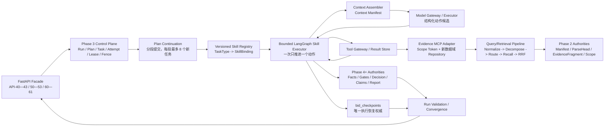

# 旗胜投标机会研判 Agent — Phase 4 可落地执行架构冻结 v0.1-r26

> 文档状态：架构冻结，尚未开始 Phase 4 代码实现与运行验证
> 编制日期：2026-08-12
> 基线：Phase 3A—3G 总收口完成，代码唯一 Alembic head 为 `20260812_0097`
> 目标：优先复用旧 Agent 中已经证明有效的能力，尽快交付“可审计、可恢复、有直接证据的初筛版本”
> 隔离边界：本架构不连接 ECS/CentOS/真实 MinIO/Redis，不启用真实模型、OCR/视觉或公网工具，不修改旧 `bid_intake_*`

---

## 1. 架构结论

Phase 4 不另建一套大 Agent Runtime。目标结构固定为：

> **Phase 3 作为唯一外层运行控制平面，LangGraph 作为单个 Task 内的有界状态转换器，所有工具统一经过 Tool Gateway，MCP 只是受控 Adapter，业务事实与报告写入新的 `bid_*` 权威表。**

首个可落地版本不是一次性完成全部七维深度分析，而是先交付一条完整的初筛纵向链：

```text
当前 Manifest/Scope
  -> 分段 Plan
  -> 10 类招标事实提取
  -> 事实冲突消解
  -> 7 项确定性硬门槛
  -> 初筛综合与确定性投入建议
  -> Claim/Evidence 校验
  -> 初筛报告 API/页面
```

它必须能明确区分：

- 资料明确支持的事实；
- 资料明确否定的事实；
- 资料未写、不可读或相互冲突；
- 系统执行失败；
- 负责人后续需要确认的企业内部信息。

首版不得为了“看起来像完整 Agent”而把 unknown 补写成结论，也不得让模型直接决定是否投标。

---

## 2. 当前基线与关键缺口

### 2.1 已经具备

- Phase 2 已提供当前 Assessment Manifest、DocumentVersion、ParseHead、ParseUnit、EvidenceFragment、LotCandidate 与 Scope 权威来源；
- Phase 3 已提供 Run Bootstrap、49 项任务目录、确定性 DAG 校验、Task/Attempt Lease、Heartbeat、Fencing、Checkpoint、Context Manifest、Tool Gateway、Result Store、AsyncOperation、Tool Dispatch、Run Validation、取消/重试/超时恢复和 API-40—43/SSE；
- 首批 Plan 已创建 8 个任务：3 个确定性范围任务和 5 个事实提取任务；
- 旧 Agent 已提供可复用的 LangGraph 图组织方式、MCP 客户端/服务边界、确定性 Query Planner、exact/semantic/hybrid 路由、BM25 + 向量 + RRF、证据门、工具预算和评测资产。

### 2.2 必须先补

1. **Plan 续段缺口**：当前 8 个任务全部完成后直接请求 Run Validation，尚不能在同一 Run 中提交下一批 Plan；因此无法到达其余事实、硬门槛和初筛报告。
2. **Skill 执行绑定缺口**：TaskContract 已冻结工具、上下文、预算和完成合同，但尚未冻结具体 `skill_id/version/hash/executor_kind`。
3. **模型调用权威缺口**：通用 `model_call_logs` 只有运维统计字段，不能表达 Assessment/Run/Task/Attempt/Context/Fence/幂等/预算血缘；不能作为新 Agent 的模型调用权威。
4. **新数据域检索缺口**：旧 MCP Repository 读取旧 EvidenceBlock/Manifest，必须改为读取当前 Run 的 Manifest/ParseHead/EvidenceFragment；旧索引不能直接作为新数据域权威。
5. **事实与报告权威缺口**：`bid_fact_assertions`、Resolved Fact、Gate、Decision、Report、Claim/Citation 等仍未实现。
6. **模型执行缺口**：Phase 3F 当前只注册本地只读 `documents.outline`，没有 Evidence MCP Adapter 和受控 Model Executor。
7. **查询澄清缺口**：问题轮次/答案表已有骨架，但 API-50—53、问题发布门和回答后续跑尚未实现。

---

## 3. 复用决策

| 旧能力 | 决定 | 新架构中的位置 |
|---|---|---|
| LangGraph `StateGraph` | 复用 | 单个 Task 内的有界动作状态机 |
| 旧单体 ReAct 图 | 不直接复用 | 拆出状态转换、动作解析、证据门思想；不再拥有 Run 生命周期 |
| 旧 SQL LangGraph Checkpointer | 不复用为权威 | 统一使用 `bid_checkpoints`；不新增第二套运行恢复表 |
| 旧 `ToolNode` 直接执行 | 不复用 | 所有调用必须先进入 Phase 3 Tool Gateway/Dispatch/Result Store |
| MCP FastMCP 服务和客户端边界 | 复用 | 新建新数据域 Repository 与更强 Scope Token，工具名映射到 Phase 3 Registry |
| Query Planner 的归一化、拆分、精确标识保护 | 复用 | `bid-query-pipeline-v1` 的确定性前处理 |
| exact/semantic/hybrid 路由 | 复用 | 不调用 LLM 的检索路由 |
| BM25 + 向量 + RRF | 复用 | 新 EvidenceFragment 索引上的基线召回与融合 |
| 候选覆盖选择器、图扩展、长期 Memory | 暂不复用 | 既有评测未通过独立泛化门或尚无业务必要性，开关保持关闭 |
| 证据门、unknown/拒答原则 | 复用 | Fact/Claim 持久化前的确定性校验 |
| 自适应工具预算 | 复用原则 | 预算由 TaskContract/Tool Gateway 执行，不由模型自报 |
| 旧 `bid-decision-policy` Skill | 复用治理方法 | 复用版本冻结、回放、候选不自动生效；不照搬旧规则值或旧表 |
| 旧模型兼容客户端 | 只复用 transport/failover 经验 | 新建受 Phase 3 血缘约束的 Model Gateway，不复制旧 Prompt 和旧状态写入 |
| 旧检索评测集和指标脚手架 | 复用方法与脱敏样本 | 重新绑定新 Manifest/Evidence ID；旧失败实验不得改名上线 |

复用的判断标准是“算法或边界已被验证”，不是“文件存在”。任何读取旧 `bid_intake_*` 权威表、绕过新 Scope、绕过 Gateway 或产生第二套运行状态的实现都不属于复用。

---

## 4. 总体架构



### 4.1 部署形态

第一版沿用单 ECS 私网形态，但在正式批准前只做本地隔离开发：

- FastAPI：只处理控制面 API、ACL、ETag、幂等与资源投影；
- Celery Runtime Worker：Plan Continuation、Task 领取、确定性 Skill；
- Agent Worker：安装 LangGraph/模型/MCP 客户端依赖，只执行已领取 Task；
- Model Executor：执行已持久化模型调用，可与 Agent Worker 同镜像、不同队列；
- Evidence MCP：私网只读服务，读取新数据域并调用内部检索服务；
- MySQL：所有权威状态和审计；
- Redis：仅队列/短期协调，不承载业务真相；
- MinIO/Milvus：分别存放大结果对象和派生向量索引，不成为事实权威。

### 4.2 建议代码边界

```text
app/services/bid_plan_continuation.py       # 阶段模板、续段请求、Plan 原子提交
app/services/bid_skill_registry.py          # 版本化 Skill artifact 加载与 Hash
app/agents/bid_assessment_local/            # 有界 LangGraph 状态、节点、动作解析
app/services/bid_model_context.py            # 模型 Context/Prompt 组装
app/services/bid_model_execution.py          # ModelCall/Attempt/Result 控制面
app/services/bid_fact_authority.py           # Assertion/Coverage/Resolved Fact
app/services/bid_preliminary_analysis.py     # HG01—HG07、Decision、Claim/Report
mcp_servers/bid_assessment_evidence/         # 新数据域 MCP server/repository
contracts/bid_assessment/v1/skills/          # 只追加的 Skill catalog/artifact
schemas/bid_assessment/v1/                   # Action/Model/Fact/Report JSON Schema
```

旧 `app/agents/bid_intake/` 和 `mcp_servers/tender_evidence/` 保持兼容代码；可复用的纯算法通过小模块抽取或新 Adapter 调用，禁止把新 Run 重新接回旧 PersistentExecutor。

---

## 5. 权威边界

| 对象 | 唯一权威 | 禁止替代 |
|---|---|---|
| Run/Plan/Task/Attempt | Phase 3 `bid_*` runtime 表 | LangGraph thread/checkpoint 表 |
| 页、Sheet、OCR、结构单元 | 当前 ParseHead/ParseUnit | 文件名、MIME、`parser_hint`、模型猜测 |
| 检索文本单元 | `bid_evidence_fragments` | 旧 EvidenceBlock 或 Milvus payload |
| Tool 请求/结果 | ToolInvocation/Dispatch/ToolResult | 模型消息历史、MCP 日志 |
| Model 请求/结果 | 新 `bid_model_calls` | 通用 `model_call_logs` |
| 工作状态恢复 | `bid_checkpoints` | LangGraph InMemory/旧 SQL saver |
| 事实 | Assertion -> Resolved Fact 权威链 | 报告正文、模型自由文本 |
| 决策 | 版本化规则/公式的确定性结果 | LLM 分数或自然语言建议 |
| 报告 | 不可变 Report/Claim/Citation 快照 | 前端临时拼接或 Chat 文本 |

向量索引、BM25 索引、MCP 缓存、Context Manifest 和模型响应都是派生或执行数据；它们可以重建，不能反向覆盖权威事实。

---

## 6. Plan Continuation

### 6.1 为什么是首个实现项

当前初始 Plan 恰好包含 8 个任务，并受 `max_dynamic_tasks=8`、`max_dependency_depth=3` 约束。若任务全部成功，现有 Task Runtime 会直接把 Run 推进到 `validating`。Phase 4 必须先把“任务全部完成”拆成两种结果：

- 当前阶段完成、Run 尚有受控后续阶段：请求下一 PlanRevision；
- 最终阶段完成：请求 Run Validation。

### 6.2 冻结协议

- 新内部事件：`bid.plan.continuation_requested.v1`；
- 同一 Run 内递增 `PlanRevision.revision_no`，一次只允许一个 current committed slot；
- 新 Revision 验证成功和提交时，上一 current Revision 才转为 `superseded`；两步必须同事务；
- `superseded` 只表示不再接收新任务，不否定其已提交 Task、Attempt、Checkpoint 和结果；
- TaskContract 必须可从自己的历史 committed/superseded Plan envelope 重构，不依赖当前代码目录漂移；
- 新任务可依赖旧 Revision 中已经存在的任务；禁止修改或复活旧 Task；
- 每段仍最多新增 8 个任务、新增子图局部深度最多 3；跨 Revision 的已成功依赖按只读根节点计入阶段顺序和全图无环校验，但不重复累计历史局部深度，否则任何合法的长流程都无法分段推进；
- continuation 决定器是确定性程序，只能选择标准阶段模板；首版不由 LLM 自由规划；
- 只有最终报告阶段完成后才能产生 `bid.run.validation_requested.v1`。

### 6.3 初筛 Run 的五段计划

| 段 | 任务 | 执行方式 |
|---|---|---|
| P0 事实基线 | 当前 3 个范围任务 + overview/dates/qualification/rejection/fees | 前 3 个确定性，后 5 个局部 Agent |
| P1 事实补齐 | evaluation/scope/deliverables/contract/schedule + conflict resolution | 5 个局部 Agent + 1 个确定性任务 |
| P2 初筛硬门槛 | HG01—HG07 | 确定性规则/计算，模型只能提供上游事实候选 |
| P3 初筛综合校验 | preliminary synthesis、decision、claim validation、report consistency | 综合文本可用模型；决策和校验必须确定性；局部深度不超过 3 |
| P4 初筛渲染 | report generation | 确定性读取已验证对象并生成不可变报告；完成后才请求 Run Validation |

当前 Planner 的 `synthesize_assessment` 深度依赖规则必须按 `run_kind/stage` 分流：preliminary 只要求事实冲突和 HG01—HG07 完成；deep 才要求七维分析全部完成。不得通过删除深度门槛来兼容初筛。

---

## 7. Skill 注册、路由与执行

### 7.1 SkillBinding

TaskDefinition 与 TaskContract 在 Phase 4 增加不可变绑定：

```json
{
  "skill_id": "bid-tender-fact-extraction",
  "skill_version": "1.0.0",
  "skill_hash": "sha256...",
  "executor_kind": "deterministic|langgraph",
  "action_contract": "bid.task.action.v1",
  "output_schema": "fact_assertion_candidates_v1"
}
```

绑定必须写入已验证的 Plan envelope 并进入 Task `input_hash`。恢复历史 Task 时读取 Plan 中的原绑定；当前 active Skill 变化不得使旧 Task 漂移。首版不新增可变数据库 Skill 注册中心，采用仓库内按版本追加、禁止覆盖的机器可读目录 + Plan 冻结副本，减少新的管理面。TaskContract 重构必须按 envelope 中的 catalog version/hash 读取保留的历史 artifact，不能再把旧 Plan 与当前 singleton active registry 比较；历史 artifact 缺失时 fail closed。

### 7.2 首版 Skill 集合

| Skill | Executor | 职责 |
|---|---|---|
| `bid-document-scope@1` | deterministic | 绑定快照、文档盘点、覆盖基线 |
| `bid-tender-fact-extraction@1` | langgraph | 十类招标事实候选与直接证据引用 |
| `bid-fact-resolution@1` | deterministic | 冲突、优先级、集合闭合、Resolved Fact |
| `bid-preliminary-gates@1` | deterministic | HG01—HG07 与稳定 reason code |
| `bid-preliminary-synthesis@1` | langgraph | 只从已解析事实/Gate 生成结构化 Claim 候选 |
| `bid-preliminary-decision@1` | deterministic | 决策、投入等级与未知上限 |
| `bid-report-validation@1` | deterministic | Claim/Evidence、决策兼容和报告一致性 |
| `bid-preliminary-report@1` | deterministic renderer | 从已验证结构化对象生成报告快照 |

旧 `bid-decision-policy` Skill 的版本冻结、回放、候选版本不自动生效机制可复用；旧政策数值和旧运行表不自动成为新规则。

### 7.3 路由

路由顺序固定：

```text
TaskContract.task_type
  -> committed SkillBinding
  -> feature/dependency gate
  -> executor_kind
  -> deterministic handler 或 bounded LangGraph executor
```

没有绑定、Hash 不匹配、Skill 不支持该 TaskType、依赖开关不闭合时一律 fail closed。模型不能注册 Skill、修改路由或选择更高权限 Profile。

---

## 8. LangGraph 的使用边界

### 8.1 保留

LangGraph 用于表达单个局部 Agent 的动作图：

```text
hydrate_state
  -> assemble_context
  -> propose_one_action
  -> validate_action
  -> persist_model_call | request_tool | persist_candidate | request_input | finish
  -> write_checkpoint
  -> yield
```

每次执行最多推进一个可持久化动作。下一步由 Task Worker 在新 lease/fence 下恢复，不在一个内存循环里持续跑完整项目。

### 8.2 不保留

- LangGraph 不拥有 Run/Plan/Task 状态；
- 不使用旧 `BidIntakeCheckpoint*` 表；
- 不使用 `ToolNode` 绕过 Tool Gateway；
- 不把完整消息历史、原始文档、密钥、Scope Token 或模型思维链写入状态；
- 不允许一个 Agent 自行扩张任务、并发调用工具或发布报告。

首版可以不配置 LangGraph 原生持久 Saver：每次从权威 TaskContract、最近 `bid_checkpoint` 和 Context/Result 引用重建图状态。LangGraph 是状态转换库，不是第二数据库。

### 8.3 动作合同

模型每次只能返回一种动作：

- `request_tool`
- `submit_fact_candidates`
- `submit_claim_candidates`
- `request_task_input`
- `finish`

动作必须通过 JSON Schema、允许动作集合、工具 Profile、预算、证据归属和 Fence 校验。模型输出只是候选；只有确定性持久化服务可以写事实、Claim 或任务完成回执。

---

## 9. Query 优化、Chunk、召回与重排

### 9.1 三种“Query”必须分开

1. **用户需求规范化**：初版目标固定为 `bid_go_no_go`，不让 LLM 擅自改写目标。
2. **检索 Query 优化**：在 Skill 内把具体 Fact Slot 转为检索计划。
3. **用户澄清问题**：只针对现有资料无法回答、且可能改变决策的内部事实；它不是检索改写。

### 9.2 `bid-query-pipeline-v1`

首版检索链固定为：

```text
FactSlot + Task objective
  -> normalize（保留日期、金额、编号、主体名）
  -> decompose（最多 3 个原子 Query）
  -> route（exact / semantic / hybrid）
  -> retrieve（每 Query 有界候选）
  -> RRF fuse
  -> stable tie-break
  -> evidence groups
  -> sufficiency audit
```

约束：

- 归一化、拆分和路由均为确定性逻辑，不消耗 LLM；
- 精确编号、日期、金额、条款名优先 exact；研判语义走 semantic；混合意图走 hybrid；
- Query 数、候选深度、Top K、二轮检索次数来自 Task budget；
- 首版不启用模型式 Query Expansion；仅使用受控同义词/字段别名表；
- 受控第二轮只在事实槽部分覆盖、仍有预算且能生成更窄 Query 时允许一次；正式启用前必须重新通过新数据域评测门。

### 9.3 Chunk 权威

- 不在 Phase 4 重新解析或随意切 Chunk；
- 最小检索单位是 Phase 2 当前 ParseHead 下的 `BidEvidenceFragment`；
- Fragment 保留 page/sheet/region/cell/heading/parent/object locator；
- 表格或跨块上下文通过 `parent_id` 和结构读取按需组成 Evidence Group，不合并改写原 Fragment；
- 索引只保存 Fragment 派生字段和稳定 ID，正文回读必须回到 MySQL/对象存储权威。

### 9.4 召回与重排

首版采用已经成熟的基线：

- exact/BM25；
- BCEmbedding + Milvus semantic；
- hybrid 的 RRF；
- 稳定 ID 作为最终同分排序键；
- 最终证据必须回源读取并校验 Manifest/ParseHead/Scope。

首版不启用 cross-encoder、LLM reranker、候选覆盖 promotion、GraphRAG 或选择性图扩展。旧实验中这些能力未通过独立泛化门或仍处于 shadow；不得因为代码已存在而直接上线。

### 9.5 索引一致性

每个检索索引头至少绑定：

```text
assessment_id + manifest_id + parse_set_hash
+ retrieval_schema_version + embedding_model_version
```

不匹配即为 stale。exact/BM25 可以在当前权威 Fragment 上降级运行；semantic/hybrid 不得读取旧索引伪装成功，必须返回明确 warning 并使充分性门保守处理。

---

## 10. MCP 架构

### 10.1 位置

MCP 是 Phase 3 Tool Executor 的一种只读 Adapter，不是 Agent 的直接旁路：

```text
LangGraph action
  -> Tool Gateway authorize/persist
  -> Dispatch
  -> Evidence MCP Adapter
  -> MCP server
  -> new-domain repository
  -> Result Store
  -> next Checkpoint
```

### 10.2 首版 MCP 工具

- `evidence.search`
- `evidence.read`
- `documents.outline`
- `tables.read_region`

`documents.compare_versions` 在版本差异切片加入；企业数据、计算器和报告读取可以继续用本地受控 Adapter，不为了 MCP 而强行 MCP 化。

### 10.3 Scope Token

Token 由 Tool Gateway 服务端注入，模型不可见、不可填写。至少绑定：

- `assessment_id`
- `run_id`
- `task_id`
- `task_attempt_id`
- `fencing_token`
- `manifest_id`
- `scope_id`
- `allowed_tools`
- `issued_at/expires_at/jti`

MCP 工具参数不得携带可切换 Assessment/Run/Manifest 的字段。Repository 每次读取再次校验当前 Run 的冻结 Manifest、Scope、ParseHead 和租户 ACL，不能只信客户端参数。

### 10.4 旧 MCP 的复用方式

保留 FastMCP server/client、结构化 ToolEnvelope、超时错误规范、Query Planner/Router/Service 的纯算法部分；替换旧 SQLAlchemy Repository 和旧 scope claims。新 Repository 只读取新 `bid_*` 权威对象。

第一版部署协议使用私有 Docker 网络内的 MCP Streamable HTTP，Tool Adapter 复用官方 async MCP client 和 Worker 生命周期内的持久 session；stdio 仅用于隔离开发，不作为正式单 ECS 运行形态。MCP 不发布宿主机公网端口。

### 10.5 Tool Router

系统需要 Tool Router，但不需要再建一个由 LLM 自由决定“去哪个系统”的 Router Agent。首版采用两层确定性路由：

1. **Task Tool Policy Router**：`TaskType + committed SkillBinding -> ToolProfile -> allowed_tools`。它决定当前任务看得见、能申请哪些工具；模型只能在这个裁剪后的集合里提交一个 `request_tool` 动作。
2. **Tool Execution Router**：`frozen ToolRegistryVersion + tool_name -> adapter_id/version/mode/replay_policy/queue/capability`。它决定获准调用由本地只读 Adapter、Evidence MCP、企业快照 Adapter、计算器或 Result Store 执行。

`evidence.search` 内部的 exact/semantic/hybrid 选择是 **Retrieval Router**，不是 Tool Router；它不能把一次 evidence 调用改路由成企业查询或计算工具。

执行顺序固定为：

```text
Skill 提交 request_tool
  -> Action Schema
  -> Task Tool Policy Router
  -> 参数/引用/预算/Scope/Fence 校验
  -> Invocation 持久化
  -> Tool Execution Router
  -> Dispatch/Adapter
  -> Result Store
```

当前代码已有 Task Policy allowlist 和 `LOCAL_ADAPTER_SPECS` 映射雏形，但后者只有 `documents.outline` 且仍是代码常量；`BidToolRegistryVersion` 虽已被 Run 冻结，执行时尚未实际解析其 artifact 来决定 Adapter。因此 Phase 4B 必须把代码常量升级为按 Run 冻结版本加载、Hash 校验的机器可读 Tool Registry，同时保留 Adapter 实例为代码注册，禁止配置注入任意 Python 路径。

建议每个 Tool Registry 条目冻结：

```json
{
  "tool_name": "evidence.search",
  "argument_schema_ref": "tools.schema.json#/$defs/EvidenceSearchArguments",
  "adapter_id": "bid-evidence-mcp",
  "adapter_version": "1.0.0",
  "adapter_mode": "mcp_streamable_http_readonly",
  "queue": "bid-tool-evidence",
  "replay_policy": "safe_idempotent",
  "timeout_seconds": 30,
  "max_attempts": 3,
  "cost_class": "internal_read",
  "capabilities": ["read_only", "scoped", "evidence_refs"]
}
```

路由器只返回已注册 Adapter ID，不执行动态 import，不接受模型提供 endpoint/queue/provider，不在 Adapter 不可用时回退到旧 MCP、Dify、n8n 或公网。找不到条目、版本 Hash 不匹配、Capability 不满足或 Adapter 未部署时一律 fail closed。

---

## 11. Model Gateway

### 11.1 新权威

新增三层模型调用权威：

- `bid_model_calls`：一个 Task action 的逻辑调用、幂等和预算；
- `bid_model_call_attempts`：每次 provider 发送的 Lease/Fence、request id、重试和未知结果；
- `bid_model_results`：不可变结构化响应或外部对象引用与 Hash。

至少记录：

- Assessment/Run/Task/Attempt/Context Manifest/Fence；
- model profile、逻辑角色、provider/model；
- action sequence、idempotency key、request/input hash；
- AsyncOperation、状态、lease/fence、超时与重试；
- token/cost budget before/after；
- 结构化响应引用、响应 Hash、错误码；
- accepted/submitted/started/finished 时间。

通用 `model_call_logs` 可以继续接收脱敏运维镜像，但不能参与恢复、幂等或业务校验。

### 11.2 执行规则

- 模型调用先持久化，再由 Executor 领取；
- Provider 请求只使用冻结 ModelProfile/PromptBundle；
- 响应必须通过动作 Schema；
- 超时前未发送可安全重试；发送后结果未知必须记录 `uncertain`，重试会产生新的 provider attempt 并计入预算；
- 旧 Fence 的晚到响应只能审计，不能写事实或推进 Task；
- 不持久化隐藏思维链；只保存 Prompt 版本、输入引用、结构化输出和必要的脱敏诊断。

---

## 12. Context 与 Memory

### 12.1 Context Manifest

每次模型动作前重新组装，不累积无限聊天历史。建议分层：

- L0：系统安全、角色、动作合同；
- L1：TaskContract 与 SkillBinding；
- L2：Run/Scope/版本绑定；
- L3：已解析事实、覆盖、冲突、依赖输出；
- L4：本动作需要的 Evidence/ToolResult 切片；
- L5：预算、停止条件、最近 Checkpoint；
- L6：输出 Schema 和禁止项。

Context Manifest 保存引用、Hash、token 估算和压缩说明，不复制大段原文。压缩只能删除低优先级上下文，不能改写日期、金额、资格、否决条款或证据 locator。

### 12.2 Memory

首版只有三种受治理记忆：

- Task working state：`bid_checkpoints`；
- Assessment 事实记忆：Assertions/Resolved Facts；
- 企业记忆：Run 冻结的 Enterprise Snapshot。

不增加跨项目自由文本长期 Memory。只有出现明确的跨会话人工修正复用需求，并具备来源、版本、有效期、撤回和租户隔离规则后，才单独设计。

---

## 13. Checkpoint 与恢复

### 13.1 唯一 Checkpoint

沿用 `bid_checkpoints`，每个动作后写连续 `action_seq` 和不可变 `state_hash`。`state_json` 首版结构：

```json
{
  "schema": "bid.local_agent.state.v1",
  "skill_binding": {"id": "...", "version": "...", "hash": "..."},
  "phase": "await_model|await_tool|validate_candidate|finish",
  "action_seq": 3,
  "observed_result_refs": ["tool-result:..."],
  "candidate_refs": ["fact-assertion-batch:..."],
  "missing_fact_slots": ["..."],
  "outstanding_operation_ref": null,
  "stop_reason": null
}
```

原始 ToolResult、ModelResult、大文本不复制进状态，只存不可变引用和 Hash；预算使用现有 `budget_usage_json`。

### 13.2 恢复顺序

```text
新 Attempt + 新 Fence
  -> 读取旧 Attempt 最近合法 Checkpoint
  -> 校验 Run/Task/Skill/Context/Result 血缘
  -> 检查 outstanding operation 是否已有终态结果
  -> 重建 LangGraph state
  -> 从 next_state 推进一个动作
```

取消、Run stale、超时和显式重试继续沿用 Phase 3 围栏。旧 Worker、旧模型响应和旧 MCP 结果在 Fence 变化后不得推进状态。

### 13.3 Human-in-the-loop

LangGraph 的 `request_task_input` 不直接弹窗：它只提交 QuestionCandidate。确定性问题服务去重、排序、最多发布 3 个问题，将 Task/Run 置为等待；API-50—53 收到回答批次后创建新的 Plan Continuation/Attempt 恢复。首个自动初筛版本可以先把非阻断缺口写入报告，API-50—53 在下一切片补齐；决定性缺口不得被自动猜测。

---

## 14. 数据与迁移门禁

从 `20260812_0097` 之后需要新的线性 revision；首个可用版本无法只靠现有表完成。建议拆分：

| Revision 候选 | 内容 | 原因 |
|---|---|---|
| `0098` | Plan Continuation 事件 CHECK | 先打通同一 Run 的分段执行，不预建尚未使用的模型表 |
| `0099` | `bid_model_calls`、`bid_model_call_attempts`、`bid_model_results` | 模型执行、成本和恢复权威 |
| `0100` | Fact Assertion/Evidence Link/Coverage/Resolved Fact/Heads | 事实候选、冲突和当前解析权威 |
| `0101` | Gate/Decision/Claim/Validation/Preliminary Report | 形成可查询、不可变初筛结果 |

最终 revision 名称以实现时实际日期和线性父节点为准，不预建空迁移。每个迁移必须：

- `down_revision` 只指向当时代码唯一 head；
- upgrade/downgrade 有孤儿和 Hash/Fence 血缘保护；
- 不读取或改写旧 `bid_intake_*`；
- 仅允许应用到独立本地/开发数据库；
- 不得进入正式发布候选，更不得应用到当前 ECS；
- ECS 仍按最近只读记录视为 `20260808_0082`，除非用户以后手工返回新的只读证据。

---

## 15. 最快可落地实现顺序

新增总开关 `FEATURE_BID_ASSESSMENT_PHASE4_MVP=false`，并以默认关闭的 `PHASE4_PLAN_CONTINUATION`、`PHASE4_LOCAL_AGENT`、`PHASE4_EVIDENCE_MCP`、`PHASE4_MODEL_EXECUTOR`、`PHASE4_FACT_AUTHORITY`、`PHASE4_PRELIMINARY_REPORT` 子开关形成依赖闭包。总开关开启时必须同时满足 Phase 3 Complete Runtime、Skill/Prompt/Tool/Model/Fact/Formula 版本和 MCP/Model secret 配置；单独子开关只用于本地隔离开发与专项验证。

### Phase 4A — Execution Foundation

1. Plan Continuation 与分段终态；
2. Skill catalog/SkillBinding/Task action contracts；
3. bounded LangGraph executor 骨架；
4. `bid_model_calls`、Model Gateway/Executor、Checkpoint 恢复；
5. 全部使用 fake model/static adapter 完成合同和故障注入验证。

### Phase 4B — Evidence MCP + Retrieval Baseline

1. 新数据域 MCP Repository；
2. `evidence.search/read`、`documents.outline`、`tables.read_region` Adapter；
3. 确定性 Query Planner/Router；
4. 新 EvidenceFragment 的 BM25/BCEmbedding/Milvus/RRF 索引协议；
5. scope、stale index、Top K、预算和回源证据门。

### Phase 4C — Fact Authority + Ten Extraction Skills

1. 事实表与持久化服务；
2. 十类事实任务输出 Schema；
3. 证据归属、directness、集合闭合与冲突消解；
4. unknown/unavailable/conflicted 与系统失败分流；
5. P0/P1 两段任务可恢复执行。

### MVP-1 — Preliminary Vertical Slice

为尽快形成业务可用版本，把完整路线中最小的 Phase 5/6 能力前移：

1. HG01—HG07 确定性规则与必要计算；
2. 初筛综合、确定性 Decision/InvestmentLevel；
3. Claim/Evidence 与报告一致性校验；
4. 不可变 Preliminary Report、API-60/61 和负责人页面；
5. API-40 -> P0/P1/P2/P3/P4 -> API-41/SSE -> Report 的本地端到端。

这一步交付的是“初筛立项辅助”，不是完整七维深入研判。报告必须清楚标记未知、冲突、技术不可读和规则版本。

### Phase 4D — 七维深度分析

在 MVP-1 稳定后，再实现企业数据任务、资格、中标、经济性、投标投入、合同交付、能力、客户战略七维 Skill；确定性计算仍归 Phase 5，不交给模型。

### Phase 4E — Query Clarification 与深度报告

补 API-50—53、问题发布/回答后续跑、版本差异、深度报告和 PDF；问题只能解决企业内部可回答事实，不能让负责人猜招标文件内容。

---

## 16. 验收门

### 16.1 静态/合同门

- Skill/Action/ModelCall/Fact/Report Schema `additionalProperties=false`；
- Plan/Task/Skill/Prompt/Tool/Model/Formula/Manifest 全部 Hash 可重构；
- MCP 参数没有 scope 切换字段；
- LangGraph 无直接 DB 状态转换、无直接 Tool/模型旁路；
- 旧 `bid_intake_*` 零修改、零运行依赖。

### 16.2 运行门

- Plan Continuation 幂等、回滚、并发唯一；
- Model/Tool 的 accepted -> pending -> terminal 可恢复；
- Lease/Heartbeat/Fence、取消、超时、晚到结果、发送后未知状态；
- Checkpoint 连续、Hash 血缘和新 Attempt 恢复；
- Task 输出原子持久化后才完成；
- 最终 Run Validation 覆盖全部 PlanRevision、Fact、Model、Tool、Claim、Report 血缘；
- 同一冻结输入重复运行，确定性任务、Gate、Decision、问题排序与引用选择稳定。

### 16.3 质量门

- 关键事实 Precision、Recall、Citation correctness；
- negative/no-answer 样本不得形成 supported Fact；
- unknown/insufficient 不得被语言润色成肯定结论；
- 证据 locator 能回到正确页/Sheet/区域；
- 旧检索评测只作为基线，必须使用未参与调参的新数据域 Development/Holdout；
- 候选重排、图扩展、第二轮检索只有独立门通过后才能打开。

所有报价资料研判 Agent 测试、评测、真实样例、OCR/视觉解析或模型调用仍须在执行前取得用户明确许可。普通静态检查不能替代上述验收。

---

## 17. 首版明确不做

- 不让一个大 Agent 从上传跑到最终报告；
- 不让模型生成或修改 DAG；
- 不让模型直接写事实、分数、门槛结果或最终决策；
- 不重新切分 Phase 2 权威内容；
- 不直接读取旧 `bid_intake_*` 作为新 Run 权威；
- 不上线 cross-encoder、LLM reranker、GraphRAG、长期 Memory；
- 不把 Dify/n8n 作为运行真相；
- 不在 Phase 4 增加写外部系统、发消息、付款、投标或审批工具；
- 不在用户明确确认全部开发完成并允许上线前触碰 ECS 正式数据域。

---

## 18. 下一实施动作

架构冻结后首先实现 **Phase 4A-1：Plan Continuation + SkillBinding 合同**。该切片不调用模型、MCP、OCR 或真实工具，但会决定后续所有 Task 是否能够在同一 Run 中按阶段持续推进，是当前可落地版本的真正入口。
