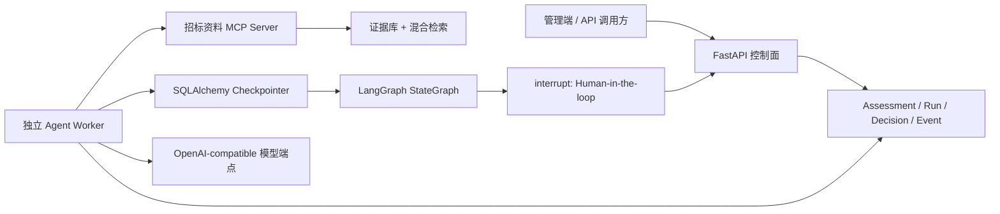

# 报价资料研判与立项辅助 Agent — Phase 4a 持久化 Runtime

## 1. 本阶段目标

Phase 4a 把 Phase 0 的内存原型改造成可长期运行的 Agent Runtime：

- LangGraph 每个节点执行后可写入 SQL Checkpoint；
- ReAct 研判到达人工审核时可靠暂停；
- API 进程、Agent Worker 或整台机器重启后，可由另一 Worker 接管；
- 人工决策先落库，再通过 `Command(resume=...)` 恢复原线程；
- 业务页面只读取稳定的研判、运行、事件和人工决策数据，不解析 LangGraph 内部序列化对象；
- 新资料版本出现后，旧研判不能被误审批。

本阶段没有迁移真实数据库、没有启动真实 Worker、没有启用功能开关。

## 2. 运行架构



FastAPI 不导入 LangGraph，也不在请求线程里运行 Agent。API 只负责创建持久任务、查询状态、提交人工决策和重试失败任务；安装 Agent 依赖的独立 Worker 负责模型与 MCP 调用。

## 3. 两层持久化

### 3.1 业务控制层

- `bid_intake_assessments`：一次研判业务对象，固定绑定证据 `manifest_version + manifest_hash`。
- `bid_intake_agent_runs`：一次执行线程、租约、重试次数、当前 Checkpoint 和状态摘要。
- `bid_intake_human_decisions`：带 UUID 幂等键的人工命令。
- `bid_intake_run_events`：不可变运行事件轨迹。

### 3.2 LangGraph Checkpoint 层

- `bid_intake_checkpoints`：图状态元数据与父 Checkpoint。
- `bid_intake_checkpoint_blobs`：按 channel version 去重保存的状态值。
- `bid_intake_checkpoint_writes`：节点 pending writes、interrupt 和 resume 数据。

Checkpoint 表使用 LangGraph 自带 serializer，业务表只保存可稳定展示和检索的 JSON 摘要。两者不能互相替代。

## 4. 状态与恢复语义

主要运行状态：

```text
queued
  -> running
  -> waiting_human
  -> resume_queued
  -> running
  -> completed
```

异常路径：

```text
running --异常--> failed --人工重试--> queued/recovery_queued
running --租约过期--> 新 Worker 领取并从最近 Checkpoint 继续
任意待执行状态 --资料版本变化--> blocked_stale_manifest
```

Worker 领取任务时写入 `lease_token + lease_expires_at`。只有持有相同 token 的 Worker 能回写结果。旧 Worker 即使晚到，也不能覆盖新 Worker 的状态。

恢复选择规则：

1. 有 queued 人工决策：`Command(resume=decision)`；
2. 没有人工决策但已有 Checkpoint：`graph.invoke(None, config)`；
3. 没有 Checkpoint：构造初始状态并首次执行。

## 5. MCP 会话

`PersistentStreamableHttpMcpToolCaller` 在一次 Agent 执行期间只初始化一次官方异步 MCP `ClientSession`。当前图仍使用同步节点，因此通过一个私有 event-loop 线程桥接同步 Tool 调用。

这一设计同时保留了：

- LangGraph 同步图的可理解性；
- MCP 官方异步客户端；
- 一次 ReAct 循环内的长连接复用；
- MCP 访问 token 不进入模型可见的 Tool 参数。

每次 Worker 执行仍签发一个项目级、assessment 级、run 级短期 token。

## 6. 模型边界

`OpenAICompatibleBidAnalysisModel` 支持标准 Chat Completions Tool Calling，可连接 OpenRouter、DeepSeek 或其他兼容端点。模型只能请求以下四个 ReAct Tool：

- `search_tender_evidence`
- `read_evidence_context`
- `compare_document_versions`
- `get_bid_policy_rule`

最终证据校验、版本新鲜度校验、审批阻断和人工决策不交给模型。

## 7. API

功能开关：`BID_INTAKE_AGENT_RUNTIME_ENABLED=true`。

主要接口：

- `POST /api/v1/admin/bidding/projects/{project_uuid}/bid-intake/assessments`
- `GET /api/v1/admin/bidding/projects/{project_uuid}/bid-intake/assessments`
- `GET /api/v1/admin/bidding/projects/{project_uuid}/bid-intake/assessments/{assessment_uuid}`
- `GET /api/v1/admin/bidding/projects/{project_uuid}/bid-intake/assessments/{assessment_uuid}/runs/{run_uuid}`
- `POST .../runs/{run_uuid}/decision`
- `POST .../runs/{run_uuid}/retry`

人工决策请求必须携带：

- `decision_uuid`：客户端幂等键；
- `report_version`；
- `manifest_version`；
- `action`；
- 可选 `note` 和 `conditions`。

## 8. 独立 Worker

安装依赖：

```powershell
python -m pip install -r requirements-agent.in
```

单次领取：

```powershell
python scripts/bid_intake_agent_worker.py --once
```

执行指定 run：

```powershell
python scripts/bid_intake_agent_worker.py --run-uuid <run_uuid>
```

常驻轮询：

```powershell
python scripts/bid_intake_agent_worker.py
```

Worker 需要：

- 主数据库连接；
- MCP URL 与 JWT 配置；
- OpenAI-compatible 模型 URL、API key 和 model id；
- 已执行到 `20260727_0066` 的数据库结构。

## 9. 验证结果

- 使用文件型 SQLite 模拟 Worker 进程重启；
- 第一个 Executor 完成 ReAct 后暂停在 `interrupt`；
- 第二个全新 Executor 从 SQL Checkpoint 恢复并应用人工审批；
- 恢复过程没有重新执行前序 ReAct 节点；
- 人工决策最终从 `queued` 变为 `applied`；
- MCP 多次 Tool/Resource 调用只初始化一次 session；
- Alembic `0065 -> 0066 -> 0065 -> 0066` 通过；
- Phase 2、Phase 3a、Phase 3b 和 Phase 4a 相关主项目回归通过。

## 10. 当前边界

- `InMemoryBidPolicy` 仍是规则引擎的开发实现，后续应替换为版本化 Skill/Policy 包；
- Worker 当前为独立轮询进程，尚未制作 Docker/Windows Service 部署包；
- 模型端点已抽象为 OpenAI-compatible，但多模型质量/成本路由不属于本阶段；
- 尚未开发前端研判详情与人工审批页面；
- 未对真实 MySQL 执行迁移，也未对真实 MCP/模型发起研判。
