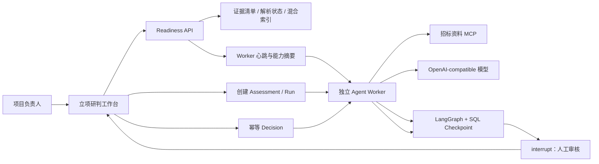

# 报价资料研判与立项辅助 Agent — Phase 4b 可操作闭环

## 1. 本阶段目标

Phase 4b 在 Phase 4a 持久化 Runtime 之上补齐“可以安全操作”的最小闭环：

- 独立 Worker 持续写入心跳和无敏感信息的能力摘要；
- 后端统一判断资料、Worker、MCP、模型和功能开关是否就绪；
- 未就绪时，前端和 API 双重阻断任务创建；
- 管理端可发起研判、查看运行轨迹、处理 Human-in-the-loop 决策和断点重试；
- 提供显式的真实 MCP / 模型连通性预检入口；
- 继续保持默认关闭，不迁移真实数据库，不自动调用真实模型。

## 2. 运行闭环



Readiness 是确定性边界，不由模型判断。只有同时满足以下条件，API 才允许创建任务：

1. `BID_INTAKE_AGENT_RUNTIME_ENABLED=true`；
2. 项目存在 active 证据清单；
3. 至少一份 active 且解析完成的资料；
4. 至少一个健康 Worker 在心跳窗口内在线；
5. 至少同一个健康 Worker 同时配置了 MCP 和模型。

混合索引尚未完成时允许使用词法检索兜底，因此它作为能力状态展示，但不作为任务创建硬阻断。

## 3. Worker 心跳

新增表 `bid_intake_worker_heartbeats`，Alembic 版本为 `20260727_0067`。

Worker 状态：

- `online`：等待领取任务；
- `busy`：正在执行某个 run；
- `error`：最近一次执行异常；
- `stopped`：进程正常退出。

心跳只保存安全摘要，例如 MCP / 模型是否已配置、Checkpoint 后端类型和当前 `run_uuid`；不保存 API key、JWT secret 或 bearer token。

默认在线窗口为 30 秒，可通过 `BID_INTAKE_WORKER_ONLINE_SECONDS` 调整。Worker 在模型与 MCP 长调用期间也会通过独立心跳线程持续刷新，默认间隔为 10 秒，可通过 `BID_INTAKE_WORKER_HEARTBEAT_SECONDS` 调整。Readiness 不相信历史进程记录，只认可窗口内的健康心跳。

## 4. 后端 API

新增：

- `GET /api/v1/admin/bidding/projects/{project_uuid}/bid-intake/readiness`

既有创建接口现在增加服务端就绪门：

- `POST /api/v1/admin/bidding/projects/{project_uuid}/bid-intake/assessments`

未就绪返回 `409`：

```json
{
  "detail": {
    "code": "BID_INTAKE_RUNTIME_NOT_READY",
    "blockers": ["WORKER_OFFLINE"]
  }
}
```

因此即使绕过前端按钮，也不能把永远无人领取的任务写入队列。

## 5. 管理端研判工作台

入口位于招投标项目抽屉的“立项研判”标签页，支持：

- 查看 Runtime、证据清单、检索模式和 Worker 状态；
- 查看并解释就绪阻断项；
- 创建研判任务；
- 查看建议、置信度、证据门、ReAct 循环数和 Tool 调用数；
- 查看十个研判维度、关键风险和运行事件；
- 对暂停任务执行批准、有条件批准、驳回、补资料或重新研判；
- 证据门存在硬阻断时禁用批准动作；
- 对失败任务从最近 Checkpoint 重试；
- 仅在任务运行中进行短轮询，离开标签页后停止。

前端只消费业务控制面的稳定 JSON，不读取或反序列化 LangGraph Checkpoint。

## 6. 真实连接预检

预检脚本：

```powershell
python scripts/bid_intake_agent_preflight.py `
  --project-uuid <project_uuid> `
  --config-only
```

默认去掉 `--config-only` 后会用短期 scoped token 对 MCP manifest 做一次只读检查：

```powershell
python scripts/bid_intake_agent_preflight.py `
  --project-uuid <project_uuid>
```

模型请求必须显式增加 `--probe-model`：

```powershell
python scripts/bid_intake_agent_preflight.py `
  --project-uuid <project_uuid> `
  --probe-model
```

`--probe-model` 可能产生模型费用。脚本不会打印密钥或 token，也不会创建研判任务。

## 7. 验证结果

- 相关主项目回归：`22 passed`；
- Agent、MCP 与持久化回归：`21 passed`；
- 新增生产适配器组合测试：真实 `OpenAICompatibleBidAnalysisModel` 与 `McpTenderEvidencePort` 在模拟网络边界下完成 ReAct、证据校验并暂停在 Human-in-the-loop；
- Worker 离线时 Readiness 返回阻断，创建接口返回 `409`；
- Vite 生产构建：`1631 modules transformed`；
- Python `compileall` 通过；
- 隔离 SQLite 上 `0066 -> 0067 -> 0066 -> 0067` 通过，最终为 `20260727_0067 (head)`；
- Worker 心跳表 MySQL DDL 编译通过。

浏览器已验证管理台路由和现有登录保护可达；由于本阶段未使用登录凭证，登录后的页面仍需在当前环境启用开关、迁移并启动 Worker 后进行人工视觉验收。

## 8. 当前边界

- 没有对真实 MySQL 执行 `0067`；
- 没有开启 `BID_INTAKE_AGENT_RUNTIME_ENABLED`；
- 没有启动常驻 Worker 或 MCP Server；
- 没有调用真实模型；
- 没有自动部署；
- 立项规则仍使用开发版 `InMemoryBidPolicy`，尚未进入版本化 Skill / Policy 包阶段。

下一阶段建议进入 Phase 4c：把总经办立项标准做成“版本化决策 Skill / Policy 包”，加入规则发布、绑定、回放评测与审计，而不是直接把标准写死在 Prompt 中。
