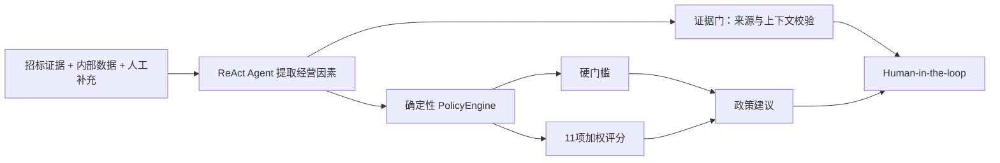

# 报价资料研判与立项辅助 Agent — Phase 4c 总经办立项标准

## 1. 本阶段目标

Phase 4c 用一版可解释、可版本化、可回放的总经办标准替换 Phase 4a/4b 的内存示例规则。

本阶段解决四个问题：

- “值得报价”不再等同于“招标资料能读懂”；
- 模型不直接算分或决定硬规则；
- 缺少企业内部数据时不猜测；
- 政策更新后，历史任务不会中途换标准。

当前标准版本：`qs_bid_decision_policy_2026_01`，状态为总经办建议稿。

## 2. 两层判断



第一层是硬门槛：

- 合规与法律风险；
- 资质与准入；
- 预计亏损；
- 不可承受的回款和垫资；
- 客户信用红线；
- 明显无法履约。

任一因素为 `critical`，政策建议为“不报价并进入特别审批”。普通批准会被控制面和 LangGraph 双重阻断。

第二层是经营评分：

| 因素 | 权重 |
|---|---:|
| 合规与法律风险 | 10% |
| 资质与准入匹配 | 10% |
| 范围与成本可控性 | 15% |
| 目标利润空间 | 15% |
| 回款与现金流 | 10% |
| 客户信用与履约可信度 | 10% |
| 工期与履约能力 | 10% |
| 战略与客户价值 | 5% |
| 中标概率与竞争态势 | 5% |
| 保证金与资金占用 | 5% |
| 投标资料与时间准备度 | 5% |

权重合计 100%。

## 3. 五档评分

| 档位 | 固定分值 |
|---|---:|
| `favorable` | 100 |
| `acceptable` | 75 |
| `adverse` | 35 |
| `critical` | 0 |
| `unknown` | 0 |

Agent 只能输出档位、摘要、来源和证据。PolicyEngine 负责：

- 分项加权；
- 总分；
- 已知信息覆盖率；
- 硬规则命中；
- 最终政策建议。

`unknown` 按 0 分，同时单独降低覆盖率。这样可以防止只掌握少量有利信息时得到虚高分数，也不会把未知伪装成确定的不利事实。

## 4. 决策分档

- 总分 ≥ 75、覆盖率 ≥ 80%、无硬规则：建议报价；
- 总分 60–74.99、覆盖率 ≥ 60%、无硬规则：有条件报价；
- 总分 < 60 且信息覆盖充分：建议不报价；
- 关键因素未知或覆盖率不足：需要补充；
- 命中硬规则：建议不报价并进入特别审批。

关键未知因素包括合规、资质、利润、回款、客户信用和履约能力。

## 5. 数据来源约束

经营因素的来源只能是：

- `tender_evidence`：来自招标资料，必须引用证据；
- `internal_data`：来自企业系统，必须写来源摘要；
- `human_input`：来自经办人或总经办，必须写来源摘要；
- `unknown`：没有可靠信息。

招标资料中的不利或红线因素必须读取证据上下文。证据缺失或未读取时，证据门会要求修复。

由于当前 Agent 尚未接入客户信用、资源计划和正式成本测算工具，真实运行时这些因素可能为 `unknown`。这是正确的安全行为，后续应通过 MCP/内部 Tool 补齐，而不是让模型猜测。

## 6. 版本冻结

Skill 目录：

- `skills/bid-decision-policy/active_version.txt`：新任务使用的版本；
- `skills/bid-decision-policy/rules/{version}.yaml`：不可变规则版本；
- `skills/bid-decision-policy/references/`：业务口径和样例；
- `skills/bid-decision-policy/scripts/replay_policy.py`：只读回放。

新增 `bid_intake_assessments.policy_version`，Alembic 为 `20260727_0068`。

任务创建时绑定 active 版本。Worker 执行或恢复时必须加载绑定版本；如果加载了其他版本，运行立即失败并保留审计事件。

## 7. 前端解释

“立项研判”工作台新增：

- active 总经办标准版本；
- 政策建议；
- 立项总分和信息覆盖率；
- 11项经营因素、权重、档位、得分、依据和来源；
- 硬门槛红色提示；
- 政策未配置或 Worker 版本过期阻断。

业务结论优先展示 PolicyEngine 的 `decision`，不再直接把模型的初步 `recommendation` 当作最终立项建议。

## 8. 回放与发布边界

回放命令：

```powershell
python skills/bid-decision-policy/scripts/replay_policy.py `
  --input <case.json> `
  --policy-version qs_bid_decision_policy_2026_01
```

输入包含固定的 `manifest` 和 `assessment`，输出政策版本、分数、覆盖率、硬规则和建议。回放只读，不写业务数据库。

本版本仍是建议稿，正式启用前应由总经办使用历史项目校准：

- 最低可接受利润档位；
- 回款和垫资红线；
- 客户信用红线；
- 各因素权重；
- 75/60 分阈值；
- 特别审批授权流程。

本阶段没有迁移真实 MySQL、没有启动 Worker、没有启用功能开关、没有调用真实模型。

## 9. 本阶段验证

- Skill 结构与元数据校验通过；
- Agent、Policy、MCP、持久化专项回归：33项通过；
- FastAPI 运行时专项回归：2项通过；
- Vite 生产构建通过，共转换 1631 个模块；
- Alembic `0067 -> 0068 -> 0067 -> 0068` SQLite 往返验证通过；
- `0068` MySQL DDL 编译验证通过；
- Python 编译检查通过。

测试环境存在 `.pytest_cache` 无写权限警告，不影响测试结果。本阶段未做登录后的浏览器视觉验收。
